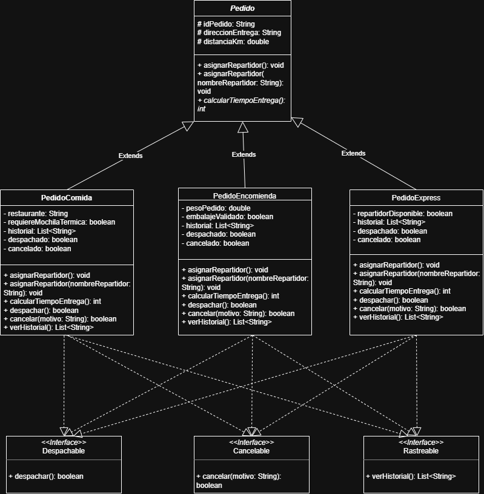

# SpeedFood

SpeedFood es un programa que busca ayudar a la empresa de reparto SpeedFast,
automatizando la asignación de repartidores para los distintos tipos de pedido
según sus características propias.

## Tecnologías usadas

- Java (JDK 25)
- IntelliJ IDEA

## Estructura del repositorio

- **semana 3/**: entrega archivada correspondiente a la Semana 3 (jerarquía de clases, polimorfismo e interfaces).
- **src/**: código fuente activo, con las entregas de Semana 3 y Semana 4 integradas.

## Estructura de clases

- **Pedido**: clase abstracta que representa un pedido genérico dentro del sistema de reparto de SpeedFood. Define los atributos comunes (`idPedido`, `direccionEntrega`, `distanciaKm`), el método `mostrarResumen()`, el método abstracto `calcularTiempoEntrega()` (implementado por cada subclase), el método abstracto `isCancelado()` y valida sus parámetros en el constructor, lanzando `IllegalArgumentException` ante datos inválidos.
- **PedidoComida**: representa un pedido de comida; hereda de Pedido, valida si se requiere mochila térmica para el transporte y calcula su tiempo de entrega en base a 15 minutos base más 2 minutos por kilómetro, más 3 minutos extra si requiere mochila térmica.
- **PedidoEncomienda**: representa un pedido de encomienda; hereda de Pedido, valida el peso (no puede ser negativo) y el embalaje del paquete, y calcula su tiempo de entrega en base a 20 minutos base más 1.5 minutos por kilómetro, más 0.5 minutos por cada kilo de peso (redondeado).
- **PedidoExpress**: representa un pedido express; hereda de Pedido, valida la disponibilidad del repartidor, y calcula su tiempo de entrega en base a 10 minutos, sumando 5 minutos extra si la distancia supera los 5 km, y 8 minutos extra si no hay repartidor disponible.
- **Repartidor** *(semana 4)*: implementa `Runnable`. Representa a un repartidor que procesa su lista de pedidos asignados de forma secuencial dentro de un hilo independiente, simulando el tiempo de entrega con `Thread.sleep()` y omitiendo pedidos nulos o ya cancelados.
- **Main**: clase principal que instancia los distintos tipos de pedido, demuestra sobrecarga y sobreescritura de `asignarRepartidor()`, invoca `calcularTiempoEntrega()` y `mostrarResumen()`, simula el flujo completo de despacho, cancelación e historial mediante `ControladorDeEnvios`, y coordina la simulación concurrente de entregas mediante `Repartidor` y un `ExecutorService`.

## Interfaces (semana 3)

- **Despachable**: define el método `despachar()`, que marca el pedido como en ruta hacia el cliente.
- **Cancelable**: define el método `cancelar(String motivo)`, que cancela el pedido siempre que no haya sido despachado previamente.
- **Rastreable**: define el método `verHistorial()`, que retorna la lista de eventos registrados del pedido.

Las tres interfaces son implementadas directamente por `PedidoComida`, `PedidoEncomienda` y `PedidoExpress`.

## ControladorDeEnvios (semana 3)

Clase orquestadora (package `cl.speedfood.gestores`) que mantiene listas de tipo `Despachable`, `Cancelable` y `Rastreable`, y permite despachar, cancelar y consultar el historial de todos los pedidos registrados sin conocer su tipo concreto.

## Concurrencia (semana 4)

Se agregó una simulación de entregas concurrentes utilizando:

- **Repartidor**: hilo productor-consumidor que recorre su lista de pedidos, imprime el avance de cada entrega (`[Repartidor: Nombre] Entregando TipoPedido #id...`) y simula el tiempo de reparto con una espera aleatoria.
- **ExecutorService**: en `Main`, se instancian 3 repartidores con al menos 2 pedidos cada uno y se ejecutan en paralelo mediante un pool de hilos, con `awaitTermination` para un cierre controlado.
- **Manejo de excepciones**: se agregaron pedidos con datos inválidos a propósito en `Main`, capturados mediante `try-catch`, demostrando que el programa continúa su ejecución sin caerse ante errores.
- **Resumen final con Streams**: al cierre de la simulación, se calcula mediante `Stream` la cantidad de pedidos cancelados versus activos/entregados.

## Diagrama de clases

## Contribución del diseño a la calidad del software

**Reutilización**: la clase abstracta `Pedido` centraliza los